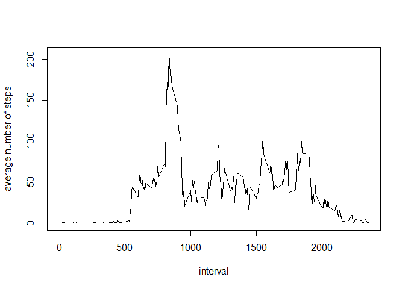

# Reproducible Research: Peer Assessment 1


## Loading and preprocessing the data

```r
knitr::opts_chunk$set(echo=TRUE)
unzip("activity.zip")
data <- read.csv("activity.csv")
```


## What is mean total number of steps taken per day?

```r
library(dplyr)
```

```
## Warning: package 'dplyr' was built under R version 3.2.2
```

```
## 
## Attaching package: 'dplyr'
## 
## Następujące obiekty zostały zakryte z 'package:stats':
## 
##     filter, lag
## 
## Następujące obiekty zostały zakryte z 'package:base':
## 
##     intersect, setdiff, setequal, union
```

```r
daily <- aggregate(steps~date, data=data, sum, na.rm=TRUE)
hist(daily$steps)
```

 

```r
mean(daily$steps)
```

```
## [1] 10766.19
```

```r
median(daily$steps)
```

```
## [1] 10765
```

## What is the average daily activity pattern?

```r
fivemin <- tapply(data$steps, data$interval, mean, na.rm=TRUE)
plot(rownames(fivemin), fivemin, type="l", xlab="interval",
     ylab="average number of steps")
```

 


## Imputing missing values
1. Numbers of missing values:

```r
complete <- !complete.cases(data)
sum(complete)
```

```
## [1] 2304
```

2. Replacing NA in column steps with global mean of steps

```r
data2 <- data %>%
        group_by(interval)%>%
        mutate(steps=replace(steps, is.na(steps), 
                             mean(steps, na.rm=TRUE)))

daily2 <- aggregate(data=data2, steps~date, sum, na.rm=TRUE)
hist(daily2$steps)
```

 
it looks quite diffrent ;)


## Are there differences in activity patterns between weekdays and weekends?
1. Creating new variable with information if it is weekday or weekend day.

```r
library(lubridate)
```

```
## Warning: package 'lubridate' was built under R version 3.2.2
```

```r
data <- data%>%
        mutate(daytype = ifelse(wday(date)==7|wday(date)==1,
                                "weekend", "weekday"))
data$daytype <- as.factor(data$daytype)
```

2. Plot with average numbers of steps across intervals for weekdays and weekends

```r
daytypesteps <- aggregate(steps~interval+daytype ,data=data, 
                          mean)
library(lattice)
xyplot(steps~interval|daytype, daytypesteps, type="l", 
       layout=c(1,2))
```

 
